# Sveltos Multi-Cluster Architecture

## Overview
This diagram represents the Sveltos-managed multi-cluster architecture with a main management cluster and multiple child clusters.

```mermaid
graph TB
    subgraph MGMT["Management Cluster (Main)"]
        SV[Sveltos Manager]
        CP[ClusterProfiles]
        ET[EventTriggers]
        ES[EventSources]

        subgraph GITOPS["GitOps Repository"]
            GH[GitHub: Bealvio/flux-mgmt]
            INFRA[Cluster-specific repos]
        end

        subgraph INFRA_SVCS["Infrastructure Services"]
            VAULT[HashiCorp Vault]
            DNS[PowerDNS]
            MINIO[MinIO]
        end
    end

    subgraph BEALV["Child Cluster: bealv"]
        B_K8S[Kubernetes API]
        B_FLUX[FluxCD]
        B_CILIUM[Cilium CNI]
        B_CERT[cert-manager]
        B_INGRESS[Ingress Controller]
        B_MONITOR[Monitoring Stack]
        B_CAPSULE_PROXY[Capsule Proxy Service]
        B_EXTERNAL_DNS[External DNS]

        subgraph BEALV_SVCS["bealv Services"]
            B_SVC[capsule-proxy-bealv Service]
            B_EP[EndpointSlice]
            B_ING["Ingress: kube.bealv.bealv.io"]
        end
    end

    subgraph CHILD["Child Cluster: cluster-name"]
        C_K8S[Kubernetes API]
        C_FLUX[FluxCD]
        C_CILIUM[Cilium CNI]
        C_CERT[cert-manager]
        C_INGRESS[Ingress Controller]
        C_MONITOR[Monitoring Stack]
        C_CAPSULE[Capsule Multi-tenancy]
        C_EXTERNAL_DNS[External DNS]

        subgraph TEMPLATE_SVCS["Template-based Services"]
            C_SVC["capsule-proxy-cluster Service"]
            C_EP[EndpointSlice]
            C_ING["Ingress: kube.cluster.bealv.io"]
        end
    end

    %% Connections
    SV --> B_K8S
    SV --> C_K8S

    CP --> B_FLUX
    CP --> C_FLUX
    CP --> B_CILIUM
    CP --> C_CILIUM
    CP --> B_CERT
    CP --> C_CERT
    CP --> B_INGRESS
    CP --> C_INGRESS
    CP --> B_MONITOR
    CP --> C_MONITOR
    CP --> C_CAPSULE
    CP --> B_EXTERNAL_DNS
    CP --> C_EXTERNAL_DNS

    %% EventTrigger flow
    ES -.->|monitors| C_CAPSULE
    ET -.->|triggers on LB IP| B_SVC
    ET -.->|creates resources| B_EP
    ET -.->|creates resources| B_ING

    %% GitOps flows
    GH --> B_FLUX
    INFRA --> C_FLUX

    %% External service connections
    VAULT --> B_CERT
    VAULT --> C_CERT
    DNS --> B_EXTERNAL_DNS
    DNS --> C_EXTERNAL_DNS
    MINIO --> B_K8S
    MINIO --> C_K8S

    %% Styling
    classDef sveltos fill:#f3e5f5,stroke:#7b1fa2,stroke-width:2px
    classDef gitops fill:#e8f5e8,stroke:#2e7d32,stroke-width:2px
    classDef infrastructure fill:#fff3e0,stroke:#ef6c00,stroke-width:2px

    class SV,CP,ET,ES sveltos
    class B_FLUX,C_FLUX,GH,INFRA gitops
    class VAULT,DNS,MINIO infrastructure
```

## Cluster Selector Labels

### Child Clusters are categorized by labels:

| Component | Label Selector | Deployed To |
|-----------|---------------|-------------|
| **Cilium CNI** | `cni: cilium` | All clusters with Cilium |
| **FluxCD** | `fluxcd: 'true'` | All GitOps-enabled clusters |
| **Cert-Manager** | `cert-manager: 'true'` | Clusters needing TLS certificates |
| **Capsule** | `capsule: 'true'` | Multi-tenant clusters |
| **Monitoring** | `monitoring: 'true' AND fluxcd: 'true'` | Monitored clusters |
| **Ingress Controller** | `ingress-controller: 'true'` | Clusters with ingress |

## Component Deployment Flow

### 1. **Base Infrastructure** (Applied to all clusters)
- **Cilium**: CNI with L2 announcements for LoadBalancer IPs
- **FluxCD**: GitOps engine with cluster-specific configurations
- **Proxmox CSI**: Storage for Proxmox-based clusters

### 2. **Security & Certificates**
- **cert-manager**: Integrates with HashiCorp Vault using AppRole authentication
- **trust-manager**: Certificate distribution
- **External Secrets**: Secret management from external sources

### 3. **Networking & Ingress**
- **Ingress Controller**: NGINX-based ingress with external load balancer
- **External DNS**: Automatic DNS record creation in PowerDNS
- **Cilium Load Balancing**: L2 announcements for service exposure

### 4. **Multi-tenancy & Monitoring**
- **Capsule**: Namespace-as-a-Service multi-tenancy
- **Monitoring Stack**: Prometheus, Grafana, Alertmanager with cluster-specific labels

### 5. **Event-Driven Services** (Capsule Integration)
- **EventSource**: Monitors `capsule-proxy-lb` service for LoadBalancer IP assignment
- **EventTrigger**: Automatically creates services, endpoints, and ingress in management cluster
- **Dynamic Ingress**: Creates `kube.{cluster}.bealv.io` endpoints for Capsule proxy access

## Template-based Configuration

Sveltos uses Go templates for dynamic configuration:

- **Cluster-specific values**: `{{ .Cluster.metadata.name }}`
- **Network configuration**: `{{ .Cluster.spec.controlPlaneEndpoint.host }}`
- **CIDR blocks**: `{{ index .Cluster.spec.clusterNetwork.pods.cidrBlocks 0 }}`
- **Resource references**: `{{ getResource "resourceIdentifier" }}`

## Data Flow

1. **Management Cluster** runs Sveltos with ClusterProfiles
2. **ClusterProfiles** use label selectors to target specific child clusters
3. **GitOps repositories** provide cluster-specific configurations
4. **Event-driven automation** creates dynamic services when Capsule proxies get LoadBalancer IPs
5. **External services** (Vault, DNS, MinIO) integrate across all clusters

## Security Integration

- **Vault PKI**: Automatic certificate issuance for each cluster
- **AppRole Authentication**: Secure Vault access per cluster
- **Secret propagation**: Template-based secret distribution
- **Certificate management**: Automated TLS for all ingress endpoints